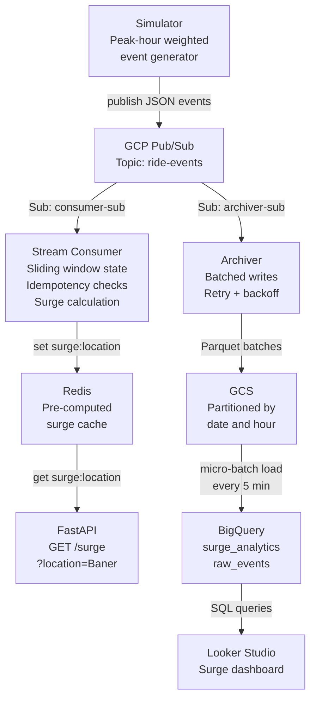
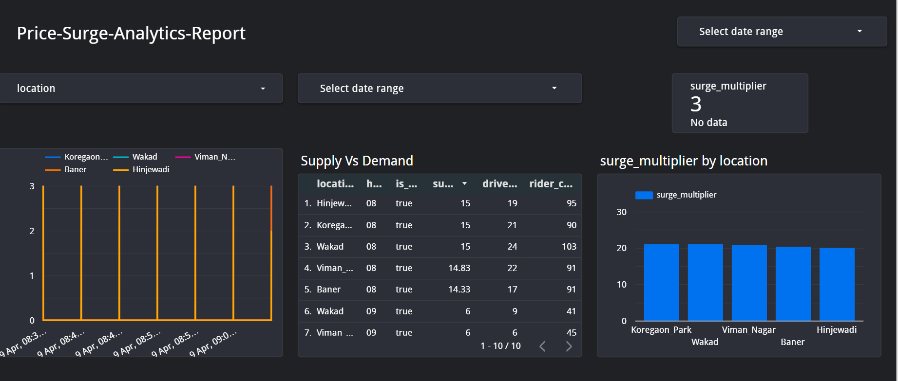

# Dynamic Pricing Streaming Platform


A production-grade real-time dynamic pricing platform inspired by ride-hailing systems like Ola and Uber. The system ingests rider and driver events through **GCP Pub/Sub**, performs stateful stream processing with **60-second sliding windows** to compute location-based surge pricing, serves low-latency pricing through a **FastAPI** endpoint backed by **Redis**, and archives raw events to **GCS as Parquet** for historical analytics in **BigQuery** — combining real-time and batch data engineering patterns end-to-end on GCP.

---

## Table of Contents

- [Architecture](#architecture)
- [Key Engineering Decisions](#key-engineering-decisions)
- [Streaming Concepts Implemented](#streaming-concepts-implemented)
- [Tech Stack](#tech-stack)
- [Project Structure](#project-structure)
- [BigQuery Schema](#bigquery-schema)
- [API Reference](#api-reference)
- [Surge Calculation](#surge-calculation)
- [Dashboard](#dashboard)
- [Quick Start](#quick-start)
- [Environment Variables](#environment-variables)
- [Running the System](#running-the-system)
- [Running Tests](#running-tests)
- [Roadmap](#roadmap)

---

## Architecture



---

## Key Engineering Decisions

**Why GCP Pub/Sub over Kafka?**
Pub/Sub is fully managed — no broker management, no Zookeeper. For a GCP-native system it integrates natively with Dataflow, BigQuery, and Cloud Run. Kafka is the right choice for sub-10ms latency requirements or multi-cloud deployments. In production, the Python consumer here would be replaced with a **Dataflow pipeline using Apache Beam** for managed windowing and fault tolerance.

**Why one topic with two subscriptions?**
The surge calculator needs both rider and driver events together to compute the demand/supply ratio. One topic with an `event_type` field eliminates a stream join. Two independent subscriptions (fan-out pattern) mean the consumer and archiver each receive every message without competing — adding a third consumer (ML features, alerts) requires zero changes to producer code.

**Why Redis for shared state?**
Consumer and API run as separate processes — Python in-memory objects cannot be shared across process boundaries. Redis provides sub-millisecond shared state accessible to both. Consumer writes pre-computed surge after every processed event. API reads a pre-computed value — zero computation at request time. In production this maps directly to **GCP Memorystore** with a single environment variable change.

**Why pull over push for Pub/Sub?**
The consumer maintains stateful sliding windows in memory. Push delivery could fan out to multiple instances — each with different state, breaking surge calculations. Pull gives the consumer control over pace and ensures one instance owns its state consistently.

**Why idempotency?**
Pub/Sub guarantees at-least-once delivery — the same message can arrive twice due to network retries. Without idempotency, duplicate events inflate rider/driver counts and produce incorrect surge multipliers. Event IDs are tracked within the same 60-second window to prevent unbounded memory growth.

**Why Parquet on GCS?**
Columnar format means BigQuery reads only the columns it needs — dramatically reducing query cost. Partitioned by date/hour so date-range queries scan only relevant files. Industry standard for data lake storage.

**Why micro-batch for BigQuery loading?**
Dashboards need minute-level freshness, not millisecond. Streaming inserts cost significantly more than batch loads. A 5-minute micro-batch pattern hits the sweet spot between data freshness and cost.

---

## Streaming Concepts Implemented

| Concept | Implementation |
|---|---|
| Sliding window | 60-second deque per location — events outside window discarded on every process and read |
| Idempotency | event_id tracked within window — Pub/Sub duplicates silently ignored |
| Event time vs processing time | event_time set by producer, used for windowing — not consumer arrival time |
| Fan-out pattern | One topic, two independent subscriptions — consumer and archiver both receive every event |
| Stateful processing | Per-location rider/driver counts maintained in memory across events |
| At-least-once + idempotency | Achieves exactly-once processing semantics at the application level |
| Micro-batch | BigQuery loader runs every 5 minutes — freshness without streaming insert cost |
| Batched archiving | Archiver buffers 300 events before flushing to GCS — reduces write operations |

---

## Tech Stack

| Layer | Technology | Purpose |
|---|---|---|
| Event simulation | Python + peak-hour weights | Realistic rider/driver demand generation |
| Message bus | GCP Pub/Sub | Durable, decoupled event delivery |
| Stream processing | Python consumer + deque | Stateful windowed surge calculation |
| Shared state | Redis | Sub-millisecond surge cache shared across services |
| REST API | FastAPI + Uvicorn | Low-latency surge endpoint |
| Data archive | GCS + Apache Parquet | Columnar raw event storage |
| Analytics | BigQuery (partitioned + clustered) | Historical surge analysis |
| Dashboard | Looker Studio | Real-time surge visualisation |
| Config | Pydantic-settings | Type-validated env-based configuration |
| Logging | JSON → GCP Cloud Logging | Structured logs with severity levels |
| Testing | pytest + unittest.mock | Unit tests with time mocking |
| CI/CD | GitHub Actions | Auto-run tests on every push |
| Containerisation | Docker + Docker Compose | One-command startup for all services |

---

## Project Structure

```
dynamic-pricing-streaming-platform/
│
├── models/
│   └── event.py                    # Immutable frozen dataclass — events are facts
│
├── config/
│   └── settings.py                 # Pydantic-settings — secrets vs config separation
│
├── ingestion/
│   └── simulator.py                # Peak-hour weighted generator + Pub/Sub publisher
│
├── processing/
│   ├── consumer.py                 # Pub/Sub pull consumer — decodes, processes, acks
│   ├── state_manager.py            # Sliding window state + idempotency tracking
│   └── surge_calculator.py         # Demand/supply ratio with floor and cap
│
├── serving/
│   └── api.py                      # FastAPI — reads pre-computed surge from Redis
│
├── storage/
│   └── archiver.py                 # Batched GCS Parquet archiver with retry + backoff
│
├── bigquery/
│   ├── schema.py                   # Dataset + table creation (partitioned + clustered)
│   ├── loader.py                   # Micro-batch loader — reads Redis, inserts to BQ
│   └── queries.sql                 # Analytical queries for dashboard
│
├── utils/
│   ├── serializer.py               # Centralised message encode/decode
│   ├── logger.py                   # JSON formatter for GCP Cloud Logging
│   ├── pubsub_helper.py            # Pub/Sub client factory — created once, reused
│   └── redis_client.py             # Redis get/set surge — singleton connection
│
├── tests/
│   └── unit/
│       ├── test_surge_calculator.py  # 6 test cases — floor, cap, zero drivers, etc.
│       └── test_state_manager.py     # 4 test cases — idempotency, window expiry, etc.
│
├── .github/workflows/
│   └── ci.yml                      # Runs pytest on every push to main
│
├── docker-compose.yml              # All services + Redis in one command
├── Dockerfile
├── requirements.txt
├── conftest.py                     # pytest path resolution
├── .env.example                    # Template — copy to .env and fill in values
└── .gitignore
```

---

## BigQuery Schema

### `dynamic_pricing.surge_analytics`

Pre-computed surge snapshots written every 5 minutes. Partitioned by `recorded_at` (date) and clustered by `location` — queries filtering by date and location scan minimal data.

| Column | Type | Description |
|---|---|---|
| `location` | STRING | Pune zone — Baner, Hinjewadi, etc. |
| `surge_multiplier` | FLOAT | Calculated surge for this window |
| `rider_count` | INTEGER | Active riders in last 60 seconds |
| `driver_count` | INTEGER | Active drivers in last 60 seconds |
| `hour_of_day` | INTEGER | Hour — used for peak hour correlation queries |
| `is_peak_hour` | BOOLEAN | True if within configured peak hours |
| `recorded_at` | TIMESTAMP | When this snapshot was taken (partition key) |
| `window_start` | TIMESTAMP | Start of the 60-second window |

### `dynamic_pricing.raw_events`

External table pointing directly to GCS Parquet files — no data copying. Used for raw event exploration and debugging. Schema auto-detected from Parquet files.

---

## API Reference

| Endpoint | Method | Description |
|---|---|---|
| `/surge?location={zone}` | GET | Current surge multiplier for a location |
| `/health` | GET | Health check — used by GCP Cloud Run |
| `/docs` | GET | Auto-generated interactive API documentation |

**Example request:**
```bash
curl "http://localhost:8080/surge?location=Baner"
```

**Example response:**
```json
{
    "location": "Baner",
    "surge_multiplier": 2.3,
    "riders": 45,
    "drivers": 18
}
```

**Valid locations:** `Hinjewadi`, `Baner`, `Koregaon_Park`, `Viman_Nagar`, `Wakad`

---

## Surge Calculation

```
surge = riders / max(drivers, 1)   # avoid division by zero
surge = max(1.0, surge)            # floor: never below 1x
surge = min(3.0, surge)            # cap: never above 3x
surge = round(surge, 2)            # two decimal places
```

Rider and driver counts are computed from events within the last 60 seconds only. Events outside the window are discarded. Duplicate events from Pub/Sub redelivery are silently ignored via idempotency checks on `event_id`.

---

## Dashboard

Real-time surge analytics dashboard built on Looker Studio connected to BigQuery.



**Charts:**
- Surge multiplier over time by location (time series)
- Supply vs demand by location and hour (table)
- Average surge multiplier by location (bar chart)
- Max surge scorecard
- Location and date range filters

---

## Quick Start

### Prerequisites

- Python 3.11+
- GCP project with billing enabled
- Services enabled: Pub/Sub, Cloud Storage, BigQuery
- Docker (for Redis and containerised run)

### GCP Setup

**1. Create service account:**
```
IAM & Admin → Service Accounts → Create
Roles: Pub/Sub Publisher, Pub/Sub Subscriber, Storage Object Admin, BigQuery Data Editor
Download JSON key — never commit this file
```

**2. Create Pub/Sub resources:**
```
Topic: ride-events
Subscription: ride-events-consumer-sub  (Pull)
Subscription: ride-events-archiver-sub  (Pull)
```

**3. Create GCS bucket:**
```
Cloud Storage → Create bucket → your-bucket-name
```

### Local Setup

```bash
# clone repo
git clone https://github.com/safiyapatel722/dynamic-pricing-streaming-platform
cd dynamic-pricing-streaming-platform

# create virtual environment
python -m venv venv
source venv/bin/activate        # Windows: venv\Scripts\activate

# install dependencies
pip install -r requirements.txt

# configure environment
cp .env.example .env
# fill in your GCP values in .env

# set GCP credentials
export GOOGLE_APPLICATION_CREDENTIALS="/path/to/sa-key.json"
# Windows: set GOOGLE_APPLICATION_CREDENTIALS=C:\path\to\sa-key.json

# create BigQuery dataset and tables — run once
python -m bigquery.schema
```

---

## Running the System

### Option 1 — Docker Compose (recommended)

```bash
docker-compose up --build
```

All services start in the correct order — Redis first, then consumer, simulator, API, archiver, and BigQuery loader.

### Option 2 — Individual services

```bash
# start Redis
docker run -d -p 6379:6379 --name redis-local redis:latest

# start each service in a separate terminal
python -m processing.consumer
python -m ingestion.simulator
python -m serving.api
python -m storage.archiver
python -m bigquery.loader
```

### Verify everything is running

```bash
# health check
curl http://localhost:8080/health

# surge for a location
curl "http://localhost:8080/surge?location=Baner"

# interactive API docs
open http://localhost:8080/docs
```

---

## Running Tests

```bash
pytest tests/ -v
```

| Test file | Scenarios covered |
|---|---|
| `test_surge_calculator.py` | More riders than drivers, more drivers than riders, zero drivers, zero riders, equal supply/demand, extreme imbalance (cap enforcement) |
| `test_state_manager.py` | Normal event increases count, duplicate event ignored (idempotency), event outside 60s window discarded, unknown location handled without crash |

Tests use `unittest.mock.patch` to control `datetime.now()` — window expiry tested in milliseconds without waiting 60 real seconds.

---

## GCS Data Layout

```
gs://your-bucket/
└── events/
    └── 2024-01-15/
        ├── 08/
        │   ├── batch_20240115_083022.parquet
        │   └── batch_20240115_085512.parquet
        └── 17/
            └── batch_20240115_173044.parquet
```

Partitioned by date and hour — BigQuery scans only relevant files when filtering by date range, reducing query cost significantly.

---

## Environment Variables

| Variable | Required | Default | Description |
|---|---|---|---|
| `GCP_PROJECT_ID` | Yes | — | GCP project ID |
| `PUBSUB_TOPIC` | Yes | — | Pub/Sub topic name |
| `PUBSUB_SUBSCRIPTION_CONSUMER` | Yes | — | Consumer subscription name |
| `PUBSUB_SUBSCRIPTION_ARCHIVER` | Yes | — | Archiver subscription name |
| `GCS_BUCKET` | Yes | — | GCS bucket for Parquet files |
| `REDIS_HOST` | No | `localhost` | Redis host — use `redis` for Docker Compose |
| `REDIS_PORT` | No | `6379` | Redis port |
| `WINDOW_SIZE_SEC` | No | `60` | Surge window in seconds |
| `SURGE_CAP` | No | `3` | Maximum surge multiplier |
| `BASE_FARE` | No | `100` | Base fare in rupees |
| `RIDER_PEAK_WEIGHT` | No | `4` | Rider event weight during peak hours |
| `DRIVER_PEAK_WEIGHT` | No | `1` | Driver event weight during peak hours |
| `RIDER_OFFPEAK_WEIGHT` | No | `1` | Rider event weight off-peak |
| `DRIVER_OFFPEAK_WEIGHT` | No | `2` | Driver event weight off-peak |

---

## Roadmap

| Status | Feature |
|---|---|
| Done | Stateful stream consumer with 60-second sliding window |
| Done | Idempotency — Pub/Sub at-least-once handled at application level |
| Done | Peak-hour weighted event simulation |
| Done | Redis shared state between consumer and API |
| Done | FastAPI surge endpoint with health check |
| Done | GCS Parquet archiver with retry and exponential backoff |
| Done | BigQuery partitioned and clustered analytics table |
| Done | Micro-batch BigQuery loader |
| Done | Looker Studio dashboard |
| Done | JSON logging for GCP Cloud Logging |
| Done | Unit tests with datetime mocking |
| Done | GitHub Actions CI |
| Done | Docker Compose — one-command startup |
| Next | Integration tests with Pub/Sub emulator |
| Next | Dataflow pipeline to replace Python consumer |
| Next | GCP Memorystore instead of local Redis |
| Next | Surge smoothing with exponential moving average |
| Next | Cloud Run deployment with auto-scaling |
| Future | Late event handling with configurable grace period |
| Future | Per-location alerting when surge exceeds threshold |

---

*Built with Python and Google Cloud Platform — Real-time dynamic pricing for ride-hailing*
